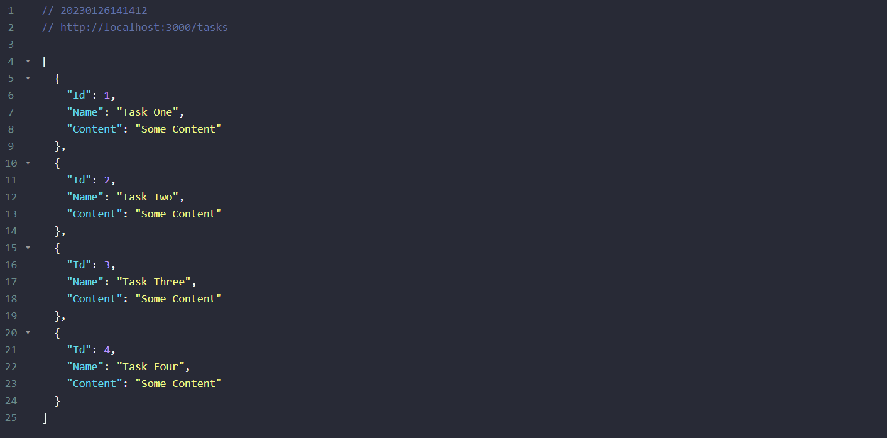

# Go-RestApi
Es una ApiRest básica hecha con GO 

### Paquetes
- Paquete que me permite hacer un enrutador
```
go get -u github.com/gorilla/mux
```
- Paquete que me permite refrescar el servidor sin la necesidad de parar y volver a ejecutar equivalente en js a (nodemon )
- instalamos
```
go get github.com/githubnemo/CompileDaemon
```
- ejecutamos el comando pero este solo guardar los cambios y no compilara
```
CompileDaemon
```
- para guardar los cambios y que ejecute la aplicacion debemos ejecutar el siguiente comando
```
CompileDaemon -command="./Go-RestApi.exe"
```

 ### Preview


<p align="center">
    
<p/>
